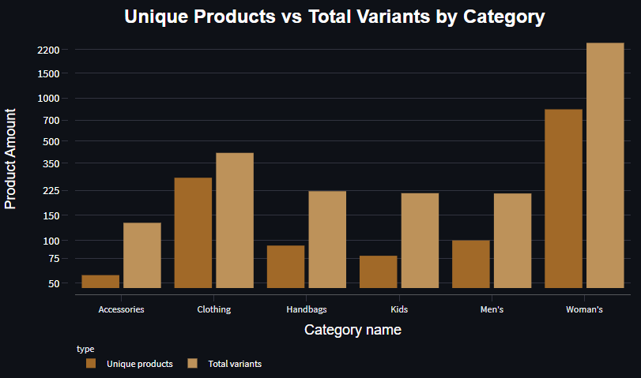
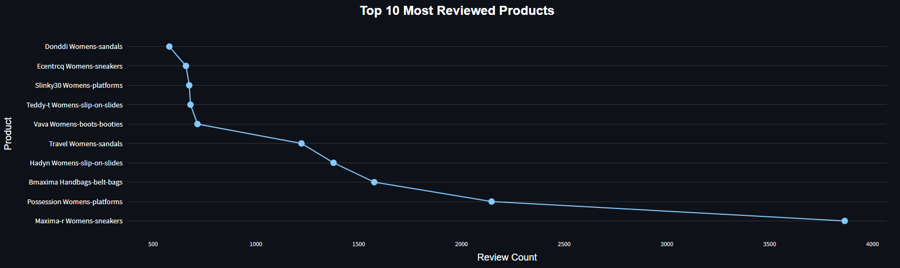
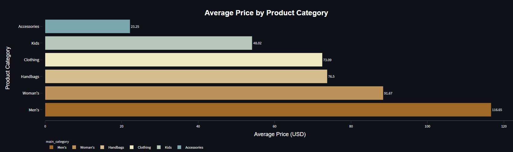
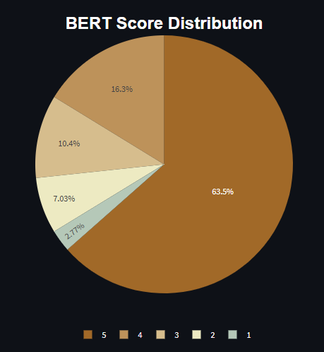
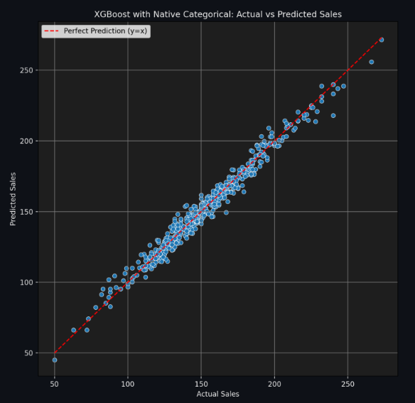
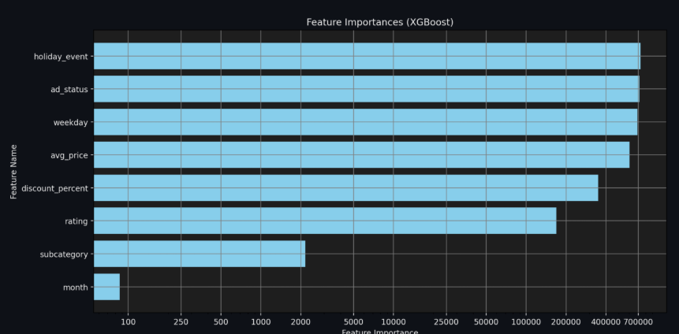

# **E-Commerce-Product-Review-Analysis**

A data analysis project exploring product trends, pricing dynamics, customer sentiment, and predictive modeling in the e-commerce domain. This project aims to deliver actionable insights through interactive visualizations and a real-time sales prediction tool.

---

## Author

- **Alexandr Lysenko** – [GitHub](https://github.com/Entire-Circus)

---

## Table of Contents

- [Project Intent](#project-intent)
- [Data Collection](#data-collection)
- [Project Structure](#project-structure)
- [Technologies Used](#technologies-used)
- [Sample Visuals](#sample-visuals)
- [Results Summary](#results-summary)

---
  
## **Project Intent**

This project prioritizes interactive insight delivery through a live dashboard, which presents a concise summary of key results from exploratory analysis, NLP, and predictive modeling. For those seeking technical depth, a full report is also available, detailing the analytical workflow and modeling techniques.

The dashboard is intended as the primary touchpoint for reviewing outcomes and exploring patterns, while the report provides a deeper look into the underlying methods and decisions supporting the analysis.

---

## **Data Collection**

The product, review, and variant data used in this analysis was sourced via a custom **web scraper** built using Python. The scraper gathers structured data from Shopify-based e-commerce store and stores it in a local SQLite database.

- See the scraping tool: [Web Scraper GitHub Repository]([https://github.com/Entire-Circus/Shopify-scraper])
- Scraped data includes product-level data: category, name, size etc., review data: review header, review text, feedback,  and variant-level data: price, color, full product name, etc.

This project uses that scraped data for in-depth analysis, sentiment extraction, and predictive modeling.

---

## **Project Structure**

1. **Data Preparation**  
   - Data cleaning and transformation  
   - Handling missing values and inconsistent formats  
   - Feature engineering

2. **Exploratory Data Analysis (EDA)**  
   - Product catalog structure  
   - Pricing and popularity trends  
   - Rating distribution and category-level performance

3. **Text Analysis (NLP)**  
   - Sentiment classification using BERT
   - Alignment of review sentiment with rating data
   - Aspect-based sentiment analysis and topic modeling with BERTopic

4. **Predictive Modeling**  
   - Feature selection and preprocessing  
   - Model training and evaluation (Poly Ridge, Random Forest, XGBoost)  
   - Performance comparison and model selection

5. **Interactive Dashboard**  
   - Built with Streamlit  
   - Visual summaries of EDA, NLP, and Predictive Modeling  
   - Real-time sales prediction using user-defined inputs  

6. **Deployment**  
   - The dashboard is containerized using **Docker** and deployed on **Render** for easy access.  
   - Hosted online, offering a lightweight, browser-based interface suitable for business users and stakeholders — no local setup required.  
   - **Live demo:** [Try the dashboard here](https://e-commerce-analysis-dashboard.onrender.com)
  
7. **Full Technical Report**  
   - Supplementary document detailing the full analytical workflow, advanced feature engineering, and modeling rationale  
   - Includes extended visualizations, deeper sentiment diagnostics, and strategic business recommendations beyond the dashboard scope
   - [Comprehensive E-commerce Data Analysis (PDF)](link)  

---

## **Technologies Used**

- **Languages**: Python  
- **Data Processing**: pandas, numpy, re, sqlite3, pathlib  
- **Visualization**: matplotlib, seaborn, plotly  
- **NLP**: transformers(BERT), torch, datasets, CountVectorizer, BERTopic, UMAP, hdbscan  
- **Modeling**: scikit-learn, random forest, xgboost
- **Web App**: Streamlit  
- **Deployment**: Docker container hosted on Render

---

## **Sample Visuals**

Click to expand

- 
- 
- 
- 
- 
- 
- 

---

## **Results Summary**

- Performed comprehensive Exploratory Data Analysis (EDA) to identify key product subcategories, pricing patterns, and customer behavior trends.  
- Applied Natural Language Processing (NLP) techniques to analyze review sentiments, uncovering gaps between star ratings and textual feedback for deeper customer insights.  
- Built, evaluated, and compared advanced predictive models (Polynomial Ridge, Random Forest, XGBoost) delivering highly accurate sales forecasts.  
- Identified critical sales drivers such as pricing, promotions, customer ratings, and timing, enabling targeted business strategies.  
- Developed an interactive, business-focused dashboard integrating data exploration, sentiment analysis, and sales prediction to empower informed decision-making.  
- Provided actionable intelligence for optimizing marketing, pricing, inventory management, and customer engagement efforts.  

---

